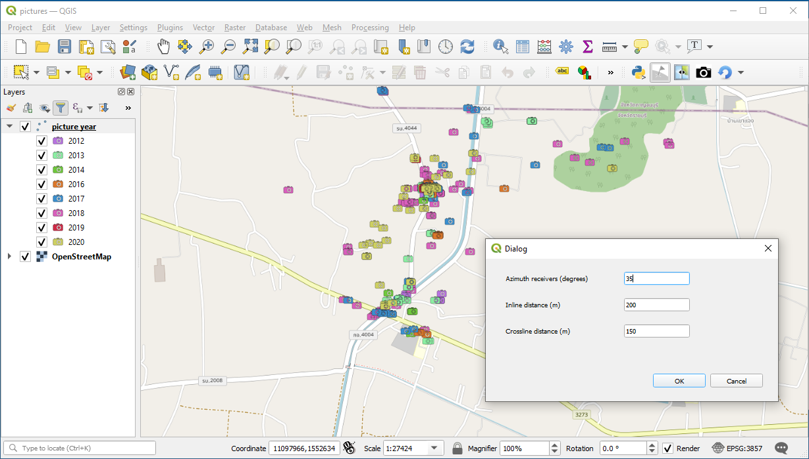
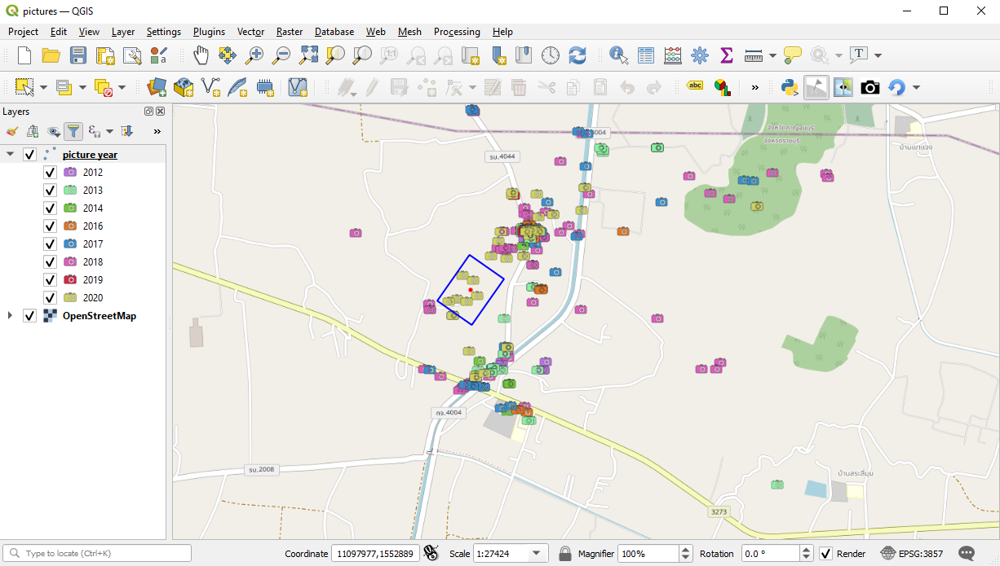

# plugin active_receivers

Plugin that will show a rectangle representing the area where receivers are active. Azimuth (of receiver line in degrees), inline offset and crossline offset are given in a dialog box

By pressing on the canvas the rectangle is shown centered around source point annotated in red.

