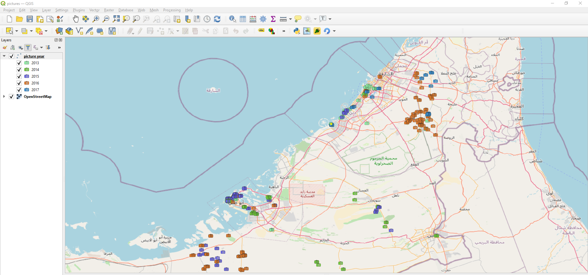
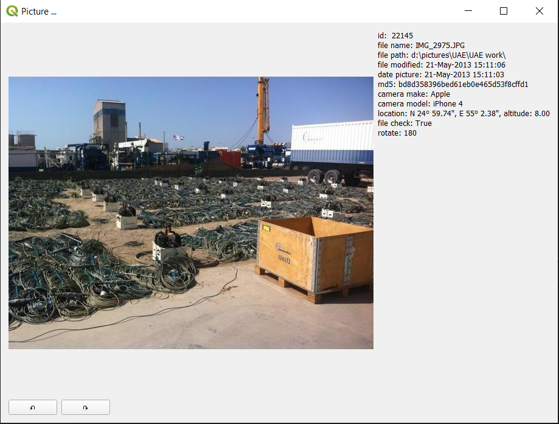

# plugin picture_linker

Will select picture on canvas and will display the picture in a seperate window

Click with mouse on the canvas and nearest picture will be selected (annotated with a yellow cross)

The selected picture will be displayed in a seperate window

