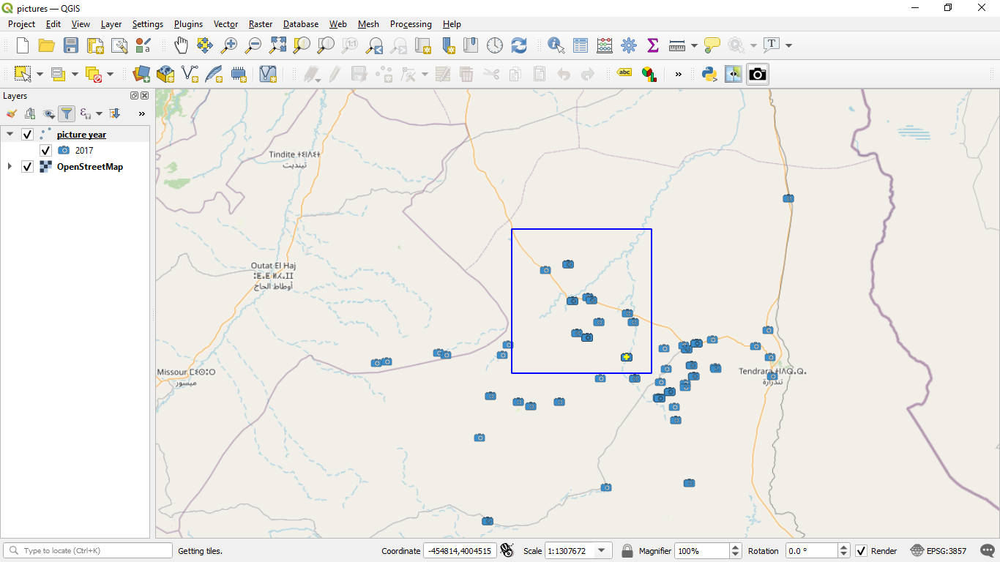
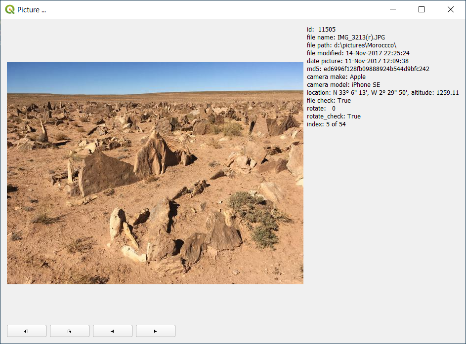

# plugin picture_select

Will draw a rubberband on the canvas and select the pictures that are within the rectangle and will display the pictures in a seperate window.

Click with mouse on the canvas and select another rectangle for a new selection

The selected picture is shown in a seperate window and you can toggle through the list of pictures either by the arrow keys or by pressing buttons.

